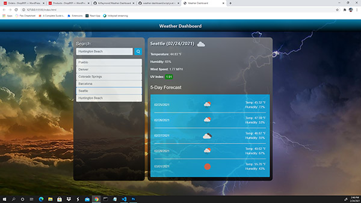

# Weather Dashboard

## Description:

This application builds a weather dashboard that will run in the browser and feature dynamically updated HTML and CSS styling that is applied to the info generated from the OpenWeather API. Using API calls you can search for a certain city and display the current weather, UV Index and the next 5 day forecast. Searches are saved in local storage for a sort term experience. Could be improved on by using a database for long term storage.

---

> ## Table of Contents

- [Installation](#installation)
- [Usage](#usage)
- [Contributing](#contributing)
- [Tests](#tests)
- [Questions](#questions)

## Installation:

To install necessary dependencies run the following command:

> n/a

## Usage Information:

App is deployed to a Github URL for user experience. Click the screenshot to demo the app.

> 

## Contributing Information:

n/a

## Tests:

To run tests, run the following command:

> n/a

## Questions:

---

> Creator Github account: [Kasey Raymond](https://api.github.com/users/KcRaymond)

> Email Creator: [kaseyleigh1978@gmail.com](mailto:)
